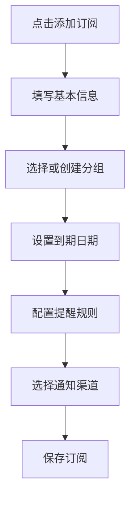
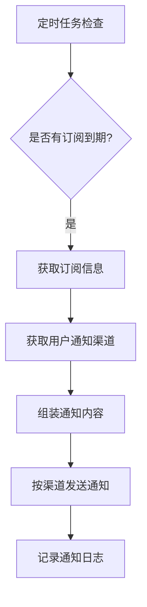

# 订阅管理系统 PRD

## 1. 产品概述

一款优雅的订阅管理工具，帮助用户追踪和管理各类订阅服务的到期时间，通过多种渠道（邮件、Telegram、飞书、微信、NotifyX 等）发送到期提醒，确保不错过任何重要续费节点。

核心价值：告别订阅过期焦虑，掌控每一笔订阅支出。

## 2. 核心功能

### 2.1 用户角色
| 角色 | 注册方式 | 核心权限 |
|------|----------|----------|
| 普通用户 | 邮箱注册/登录 | 管理订阅、设置提醒、配置通知渠道 |

### 2.2 功能模块
1. **仪表盘** - 概览所有订阅状态，即将到期高亮提醒
2. **订阅管理** - 添加、编辑、删除订阅，设置到期时间
3. **分组管理** - 按类别（流媒体、开发工具、生活服务等）对订阅进行分组
4. **提醒设置** - 设置到期前 N 天发送提醒
5. **通知渠道配置** - 配置多种通知渠道的连接信息
6. **通知日志** - 查看历史提醒发送记录

### 2.3 页面详情
| 页面名称 | 模块名称 | 功能描述 |
|----------|----------|----------|
| 登录/注册 | 认证模块 | 邮箱密码登录注册 |
| 仪表盘 | 概览卡片 | 显示总订阅数、即将到期（7天内）、已过期统计 |
| 仪表盘 | 到期日历 | 日历视图展示订阅到期日期 |
| 仪表盘 | 快捷添加 | 快速添加新订阅入口 |
| 订阅列表 | 筛选排序 | 按分组、状态筛选，支持到期时间排序 |
| 订阅列表 | 订阅卡片 | 显示订阅名称、图标、到期日期、分组标签 |
| 订阅详情 | 基本信息 | 名称、描述、费用、分组、续费周期 |
| 订阅详情 | 到期设置 | 到期日期、提醒设置 |
| 分组管理 | 分组列表 | 创建、编辑、删除分组，设置分组颜色/图标 |
| 通知渠道 | 渠道配置 | 添加/编辑/删除各渠道配置（Telegram、飞书、微信、邮件、NotifyX） |
| 通知渠道 | 测试通知 | 发送测试消息验证渠道连通性 |
| 设置页面 | 用户设置 | 修改密码、主题偏好 |

## 3. 核心流程

### 3.1 添加订阅流程

### 3.2 提醒发送流程

## 4. 用户界面设计

### 4.1 设计风格
- **主题**：暗色系 + 渐变强调色（深邃科技感，契合工具属性）
- **配色方案**：
  - 主色：#6366F1（靛蓝紫）
  - 辅色：#8B5CF6（紫罗兰）
  - 背景：#0F0F23（深空蓝黑）
  - 卡片：#1A1A2E（暗紫灰）
  - 文字：#E2E8F0（浅灰白）
  - 警告：#F59E0B（琥珀橙）
  - 危险：#EF4444（警示红）
  - 成功：#10B981（翠绿）
- **字体**：JetBrains Mono（数据展示）+ Noto Sans SC（中文内容）
- **按钮风格**：圆角卡片按钮，hover 时微光晕效果
- **布局风格**：侧边栏导航 + 主内容区卡片式布局
- **图标风格**：Lucide Icons，线性风格

### 4.2 页面设计概述
| 页面名称 | 模块名称 | UI 元素 |
|----------|----------|---------|
| 仪表盘 | 统计卡片 | 渐变边框、数字计数动画、图标 |
| 仪表盘 | 日历组件 | 月份切换、到期日期标记点、hover 预览 |
| 订阅列表 | 卡片网格 | 订阅图标、名称、到期倒计时、快捷操作 |
| 订阅详情 | 表单组件 | 标签输入、日期选择器、颜色选择器 |
| 分组管理 | 列表拖拽 | 拖拽排序、分组颜色条 |
| 通知渠道 | 渠道卡片 | 渠道图标、状态指示灯、配置表单 |

### 4.3 响应式策略
- 桌面端优先设计
- 平板适配：侧边栏折叠为图标模式
- 移动端适配：侧边栏隐藏为底部 Tab 导航

## 5. 通知渠道配置

### 5.1 支持的渠道
| 渠道 | 配置参数 | 说明 |
|------|----------|------|
| 邮件 | SMTP 服务器、端口、账号、密码、收件人 | 支持任意邮箱 |
| Telegram | Bot Token、Chat ID | 通过 Bot 发送消息 |
| 飞书 | Webhook URL | 自定义机器人 |
| 微信 | 企业微信 Webhook | 企业微信群机器人 |
| NotifyX | API Key | 第三方推送服务 |

### 5.2 提醒触发规则
- 到期前 N 天发送提醒（可配置，默认为 1、3、7 天）
- 每个订阅可独立设置提醒天数
- 同一渠道同一订阅不重复发送

## 6. 数据统计

### 6.1 关键指标
- 订阅总数
- 本月到期数
- 即将到期（7天内）数
- 已过期未续费数
- 通知发送成功率
