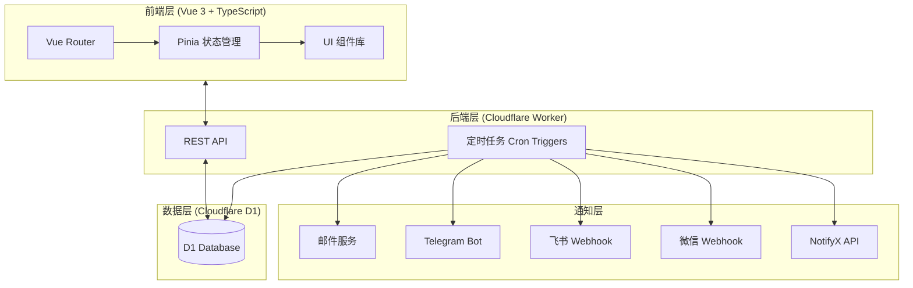
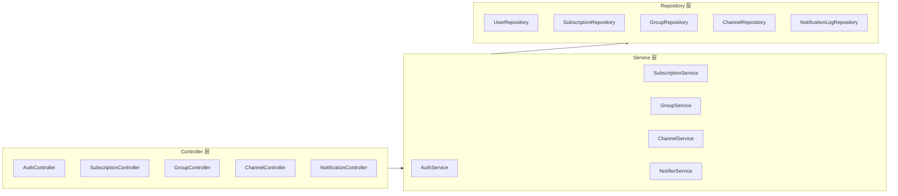
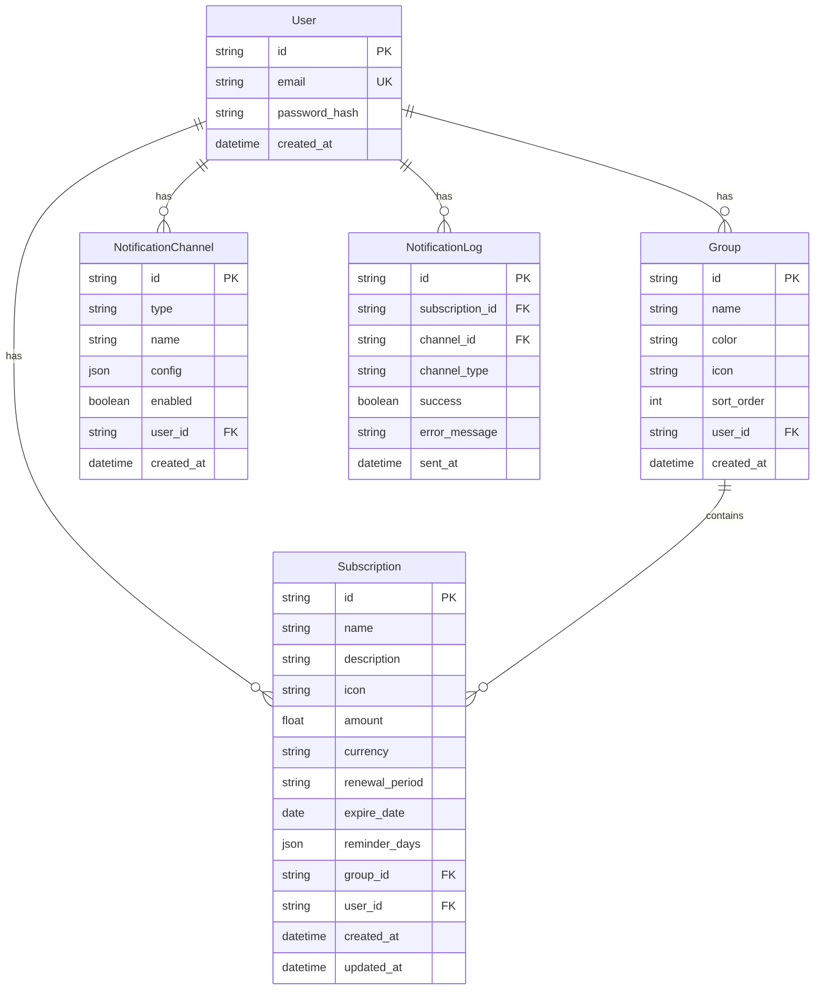

# 订阅管理系统 - 技术架构文档

## 1. 架构设计



## 2. 技术栈说明

### 2.1 前端
- **框架**：Vue 3.4+ (Composition API + `<script setup>`)
- **类型系统**：TypeScript 5.x
- **状态管理**：Pinia
- **路由**：Vue Router 4
- **HTTP 客户端**：Ky (轻量级 Fetch 封装)
- **UI 组件**：自定义组件 + Lucide Vue Icons
- **构建工具**：Vite 5
- **样式**：CSS Variables + Scoped CSS

### 2.2 后端
- **运行时**：Cloudflare Workers (Node.js 兼容模式)
- **框架**：Hono (轻量、高性能)
- **认证**：JWT (使用 Cloudflare Workers KV 存储密钥)
- **定时任务**：Cloudflare Cron Triggers

### 2.3 数据库
- **主数据库**：Cloudflare D1 (SQLite 兼容)
- **ORM**：Drizzle ORM (类型安全)

### 2.4 部署
- **前端**：Cloudflare Pages
- **后端**：Cloudflare Workers
- **数据库**：Cloudflare D1

## 3. 路由定义

### 3.1 前端路由
| 路径 | 页面 | 说明 |
|------|------|------|
| / | Dashboard | 仪表盘首页 |
| /login | Login | 登录页 |
| /register | Register | 注册页 |
| /subscriptions | SubscriptionList | 订阅列表 |
| /subscriptions/:id | SubscriptionDetail | 订阅详情 |
| /groups | GroupList | 分组管理 |
| /channels | ChannelList | 通知渠道配置 |
| /settings | Settings | 用户设置 |

### 3.2 API 路由
| 方法 | 路径 | 说明 |
|------|------|------|
| POST | /api/auth/register | 用户注册 |
| POST | /api/auth/login | 用户登录 |
| GET | /api/auth/me | 获取当前用户 |
| GET | /api/subscriptions | 获取订阅列表 |
| POST | /api/subscriptions | 创建订阅 |
| PUT | /api/subscriptions/:id | 更新订阅 |
| DELETE | /api/subscriptions/:id | 删除订阅 |
| GET | /api/groups | 获取分组列表 |
| POST | /api/groups | 创建分组 |
| PUT | /api/groups/:id | 更新分组 |
| DELETE | /api/groups/:id | 删除分组 |
| GET | /api/channels | 获取通知渠道列表 |
| POST | /api/channels | 创建通知渠道 |
| PUT | /api/channels/:id | 更新通知渠道 |
| DELETE | /api/channels/:id | 删除通知渠道 |
| POST | /api/channels/:id/test | 测试通知渠道 |
| GET | /api/stats | 获取统计数据 |
| GET | /api/notifications | 获取通知日志 |

## 4. API 详细定义

### 4.1 认证相关

#### POST /api/auth/register
```typescript
// Request
interface RegisterRequest {
  email: string;
  password: string;
}

// Response
interface AuthResponse {
  token: string;
  user: {
    id: string;
    email: string;
    createdAt: string;
  };
}
```

#### POST /api/auth/login
```typescript
// Request
interface LoginRequest {
  email: string;
  password: string;
}

// Response
interface AuthResponse {
  token: string;
  user: {
    id: string;
    email: string;
  };
}
```

### 4.2 订阅相关

```typescript
interface Subscription {
  id: string;
  name: string;
  description?: string;
  icon?: string;
  amount?: number;
  currency?: string;
  renewalPeriod?: 'monthly' | 'yearly' | 'custom';
  expireDate: string; // ISO date
  reminderDays: number[]; // e.g., [1, 3, 7]
  groupId?: string;
  userId: string;
  createdAt: string;
  updatedAt: string;
}
```

### 4.3 分组相关

```typescript
interface Group {
  id: string;
  name: string;
  color: string;
  icon?: string;
  sortOrder: number;
  userId: string;
  createdAt: string;
}
```

### 4.4 通知渠道相关

```typescript
interface NotificationChannel {
  id: string;
  type: 'email' | 'telegram' | 'feishu' | 'wechat' | 'notifyx';
  name: string;
  config: Record<string, string>; // 加密存储
  enabled: boolean;
  userId: string;
  createdAt: string;
}
```

## 5. 服务架构



## 6. 数据模型

### 6.1 ER 图



### 6.2 DDL 语句

```sql
-- 用户表
CREATE TABLE users (
    id TEXT PRIMARY KEY,
    email TEXT UNIQUE NOT NULL,
    password_hash TEXT NOT NULL,
    created_at DATETIME DEFAULT CURRENT_TIMESTAMP
);

-- 分组表
CREATE TABLE groups (
    id TEXT PRIMARY KEY,
    name TEXT NOT NULL,
    color TEXT DEFAULT '#6366F1',
    icon TEXT,
    sort_order INTEGER DEFAULT 0,
    user_id TEXT NOT NULL,
    created_at DATETIME DEFAULT CURRENT_TIMESTAMP,
    FOREIGN KEY (user_id) REFERENCES users(id) ON DELETE CASCADE
);

-- 订阅表
CREATE TABLE subscriptions (
    id TEXT PRIMARY KEY,
    name TEXT NOT NULL,
    description TEXT,
    icon TEXT,
    amount REAL,
    currency TEXT DEFAULT 'CNY',
    renewal_period TEXT DEFAULT 'monthly',
    expire_date DATE NOT NULL,
    reminder_days TEXT DEFAULT '[1,3,7]',
    group_id TEXT,
    user_id TEXT NOT NULL,
    created_at DATETIME DEFAULT CURRENT_TIMESTAMP,
    updated_at DATETIME DEFAULT CURRENT_TIMESTAMP,
    FOREIGN KEY (group_id) REFERENCES groups(id) ON DELETE SET NULL,
    FOREIGN KEY (user_id) REFERENCES users(id) ON DELETE CASCADE
);

-- 通知渠道表
CREATE TABLE notification_channels (
    id TEXT PRIMARY KEY,
    type TEXT NOT NULL,
    name TEXT NOT NULL,
    config TEXT NOT NULL,
    enabled INTEGER DEFAULT 1,
    user_id TEXT NOT NULL,
    created_at DATETIME DEFAULT CURRENT_TIMESTAMP,
    FOREIGN KEY (user_id) REFERENCES users(id) ON DELETE CASCADE
);

-- 通知日志表
CREATE TABLE notification_logs (
    id TEXT PRIMARY KEY,
    subscription_id TEXT NOT NULL,
    channel_id TEXT NOT NULL,
    channel_type TEXT NOT NULL,
    success INTEGER DEFAULT 0,
    error_message TEXT,
    sent_at DATETIME DEFAULT CURRENT_TIMESTAMP,
    FOREIGN KEY (subscription_id) REFERENCES subscriptions(id) ON DELETE CASCADE,
    FOREIGN KEY (channel_id) REFERENCES notification_channels(id) ON DELETE CASCADE
);

-- 索引
CREATE INDEX idx_subscriptions_user_id ON subscriptions(user_id);
CREATE INDEX idx_subscriptions_expire_date ON subscriptions(expire_date);
CREATE INDEX idx_groups_user_id ON groups(user_id);
CREATE INDEX idx_notification_channels_user_id ON notification_channels(user_id);
CREATE INDEX idx_notification_logs_subscription_id ON notification_logs(subscription_id);
```

## 7. 通知发送逻辑

### 7.1 Cron 触发器配置
- 执行频率：每小时执行一次 (`0 * * * *`)
- 逻辑：检查所有用户的所有订阅，计算到期前 N 天的订阅，发送通知

### 7.2 通知发送流程
1. 查询所有启用的通知渠道
2. 查询所有到期日期在提醒范围内的订阅
3. 检查是否已发送过通知（防止重复）
4. 按渠道组装消息内容
5. 调用各渠道 API 发送通知
6. 记录发送日志

### 7.3 消息模板
```
📅 订阅到期提醒

订阅名称：Netflix
到期日期：2024-01-15
剩余天数：3 天

💡 请及时续费以避免服务中断
```
